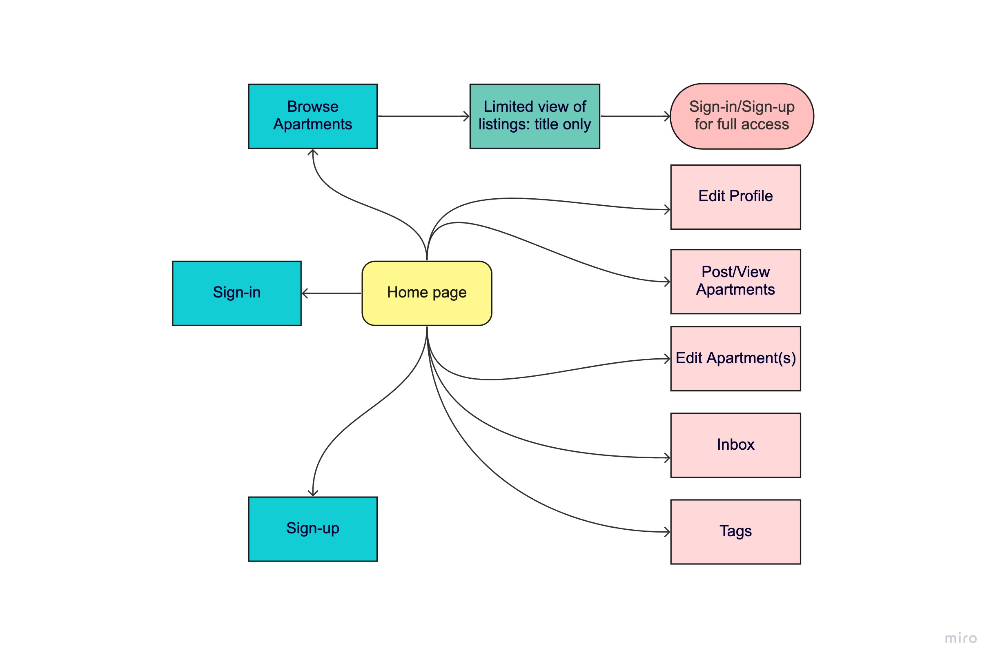

# ApartmentNYC

A fullstack MERN application which allows users the option to create an apartment listing or find an apartment from a posted listing. 

## Tech stack

MongoDB, Express, React, Node

## User flows

- From the home page:
    - Easily log on or sign up
    - Search apartments by zipcode
- Once logged in:
    - Create an apartment listing and tags for association
    - Find an apartment and contact the owner
    - Edit apartment listing and tags
    - Delete apartment listing and tags

## Flow Chart

## ERDs for database management

## Timeline of Daily Sprints

1. Planning out features and functionality, developing wireframes, planning data management, create schedule for the week via Trello
2. Every morning I planned out what needed to be done for the day. I set daily goals to achieve and checked them off as I completed them.
